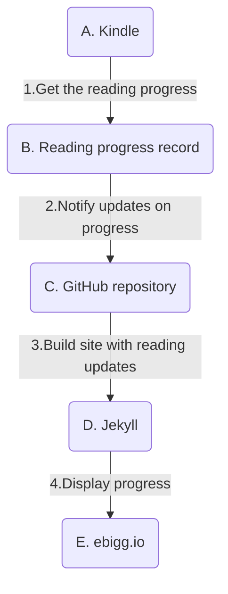
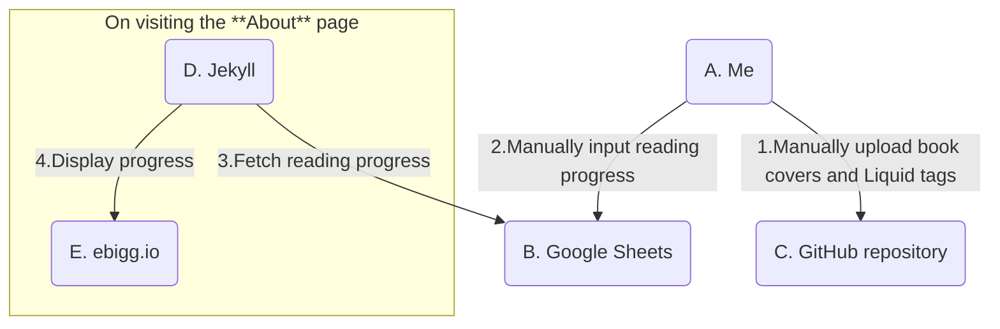

I want to make an honest confession: I have a _lot_ of pending books to read.
I have bought bundles from sites like Humble Bundle, Packt, and Amazon, but I haven't developed a solid reading habit.
So I thought, why not try to _gamify_ the process a bit? I could create a virtual bookshelf on my site, and track my reading progress for each book.
This way, I can have a visual reminder of the books I have pending and how far I have advanced on my reading.
Most importantly, having them displayed on my site will give me a sense of accountability to finish them.
Perhaps the crushing weight of public shame for not making progress is the motivation that I need to start reading more.

## The idea

- [ ] Create a virtual bookshelf on my site, where the cover of the books that I have read or am reading is displayed.
- [ ] Show the reading progress for each book visually.
- [ ] Be able to update the progress of each book easily, without having to modify the site's code.

## The constraints

- [ ] Keep the process simple, so I don't have to spend a lot of time updating the bookshelf.
- [ ] Use free tools and services whenever they are available.
- [ ] Make the process as automated as possible.
- [ ] Avoid changing the Jekyll theme, to ensure future compatibility with updates.

## The actors

- **Kindle**: The device that I use to read most of my books.
- **GitHub**: The repository where my site is hosted.
- **Jekyll**: The static site generator that I use for my site.

## The concept

When I first thought about this idea, I imagined that the process could be something like this:



I'll go through each step with details about the actual implementation.

## A. Kindle

I read most of my books on my Kindle. It's a great device that I try to carry with me everywhere. With just a few taps, I can resume reading where I left off.
Sadly, this ease of use doesn't translate to ease of integration. Being a closed ecosystem, Kindle doesn't provide an API to get or export statistics about interactions with the device.
Amazon also doesn't provide a way to get the reading progress of a book from the Kindle app or their website.
I looked for ways to get this information from the Kindle itself, and it seems that some Calibre plugins exist that could be used to extract the reading progress from the device.
However, I didn't want to go down that rabbit hole, so I discarded a direct integration with the Kindle.

### 1. Get the reading progress

While I will still use my Kindle to read, I will have to manually update the reading progress for each book.
I recognize that this situation already clashes with some of the constraints previously defined, but it's the simplest compromise to get the information needed.

## B. Reading progress record

We now need _something_ to store the reading progress for each book.
For this, I used a reliable tool: a spreadsheet in Google Sheets. This document has only two columns: the ISBN or ASIN of the book, and the reading percentage as an integer from 0 to 100.

| ISBN or ASIN | Reading percentage |
| 978-1492043454 | 100 |
| 978-1492075455 | 12 |

So, whenever I make **significant** progress in a book, I will update the percentage in this spreadsheet.
You can see the actual spreadsheet [here](https://docs.google.com/spreadsheets/d/1P1DAHbvzUZZBlKl6Xlt1YrHsAJYvlRm1F7ZPHVbE4F8/edit?usp=sharing).

### 2. Notify updates on progress

Great! We have a place that holds the reading progress for each book. How can now "pass" this information to the site?

#### Original approach

Initially, I thought about using a Google Apps Script to read the spreadsheet and update a JSON file in the repository with the reading progress.
This script would be triggered whenever the spreadsheet is updated, and it would send a POST request to a GitHub API endpoint to update the file.
This way, the site could read the JSON file and display the reading progress for each book.
While this approach is feasible (an actual implementation was made), it had some drawbacks:

- **Security**: The script would have to communicate with the GitHub API to operate on a specific repository, which requires authentication.
This authentication would require a personal access token (PAT), which would be directly embedded in the script.
This would be a **considerable security risk**, as anyone with access to the script could use the token to access the repository.
It also added the additional overhead of managing the token and its expiration.
- **Complexity**: To avoid exposing the personal access token if I accidentally shared the spreadsheet with editing permissions,
I made a [standalone script](https://developers.google.com/apps-script/guides/standalone) instead of one bundled to the spreadsheet.
This, in turn, added another layer of complexity to the process: I had to configure script triggers to be fired when the spreadsheet was updated,
intelligent enough to avoid multiple executions in a short period (to avoid hitting the GitHub API if I started playing with the spreadsheet).
- **Maintenance**: The script would have to be maintained and updated whenever my PAT expired, since I always create them with an expiration date.

So, after all this discovery, I changed the approach. Instead of "pushing" the reading progress to the site, the site would "pull" the progress from the spreadsheet.

#### New approach

I published the spreadsheet to the web, which generates a public URL that allows programmatic access to the data, in a CSV format.
The site can then use this URL to fetch the reading progress for each book, using a simple HTTP request.

> Something important to consider, is that there's a delay between updating the spreadsheet and the changes being reflected in the published CSV.
> If you happen to follow this approach, don't despair if the changes don't show up immediately.
{: .prompt-warning }

## C. GitHub repository

Since I want to display the cover of the books on the site, I will need to store them in the repository.
I created a new folder in the repository, `assets/img/books`, where I store each book cover with the ISBN or ASIN as the filename.
Then, I added them to my [About page](/about), where I wanted to display the virtual bookshelf, using the following Liquid tag:

```liquid
{: .normal .book-cover }
```

The important bit here is the `.book-cover` class, which is used to style the image.
For each book, I will manually add the cover to the repository and update the "About" page Markdown with the corresponding Liquid tag.

#### "Wait, you said the forbidden word: _manually_"

Yes, I know. This is another compromise that I made. But its certainly **not** a necessary one. As a potential improvement, one could:

- Use a script to fetch the book covers from an API like Open Library or Google Books, based on the ISBN or ASIN.
- Store the covers in the repository using the GitHub API, following the previous naming convention.

This is something that I actually tested. For example, with Open Library, you can get the cover of a book with a simple HTTP request:

```bash
https://covers.openlibrary.org/b/isbn/978-1492043454-M.jpg
```

But this is _another_ rabbit hole that I had to force myself to avoid. Perhaps for a part two of this post I could explore this further.
But for now, I will upload the covers manually after editing them a bit to have a consistent size and style.

### 3. Build site with reading updates

Since we changed the original approach (from "push" to "pull"), we won't need to build the site every time the reading progress is updated, which is a good improvement.
The site will fetch the reading progress from the spreadsheet every time the [About page](/about) is visited, and display the progress for each book accordingly.

## D. Jekyll

The site is built with Jekyll, with Chirpy as the theme. These conditions don't present any particular challenge for the implementation, which at this point is fairly straightforward.
However, I am new to this ecosystem, so it is possible that the following steps could be refined or improved.

- I created a new JavaScript file, `reading-progress.js`, that fetches the reading progress from the spreadsheet and updates the ``'s parent `<a>` element with the corresponding progress:

```javascript
document.addEventListener('DOMContentLoaded', function () {
  const sheetURL = "https://docs.google.com/spreadsheets/d/e/2PACX-1vTx_54zoSShN9OqSWpGmTVqq2pO3LeKrX1Xf_H23qG2R-XINv8NWioHWr30LiUbBRqe-EtTkCF6tHlB/pub?gid=0&single=true&output=csv";

  fetch(sheetURL)
    .then(response => response.text())
    .then(csv => {
      // Remove any \r characters before splitting
      let lines = csv.replace(/\r/g, "").trim().split("\n");

      // Ignore header, and convert the second column to a number
      let data = lines.slice(1).map(line => {
        let [book_id, progress] = line.split(",");
        return [book_id, Number(progress)];
      });
      // Convert to object for easier access
      let book_progress_record = Object.fromEntries(data);

      const bookLinks = document.querySelectorAll('a.book-cover');

      bookLinks.forEach(cover => {
        let img = cover.querySelector('img');
        // Get the book_id from the img element src attribute (the filename)
        let book_id = img.src.split('/').pop().split('.')[0];

        let progress = 0;

        if (book_id && img && book_progress_record[book_id] !== undefined) {
          // Check if progress is a number between 0 and 100
          if (typeof book_progress_record[book_id] === 'number' && book_progress_record[book_id] >= 0 && book_progress_record[book_id] <= 100) {
            progress = book_progress_record[book_id];
          }
        }

        // Set the custom property so the CSS can read it
        cover.style.setProperty('--progress', progress + '%');
        cover.setAttribute('data-progress', progress + '% read');
      });
    })
    .catch(error => console.error(error));
});
```
{: file="assets/js/reading-progress.js"}

- I added the following CSS styles to display the reading progress visually:

```css
.book-cover {
  position: relative;
  display: inline-block; /* Ensures container matches the image size */
  --progress: 0%;        /* Default: 0% read */
}

.book-cover img {
  display: block;
}

/*
   Dimming overlay:
   - top portion is partially opaque (e.g., 50% black),
   - bottom portion is transparent, based on --progress.
*/
.book-cover::before {
  content: "";
  position: absolute;
  top: 0; left: 0; right: 0; bottom: 0;
  pointer-events: none;  /* click-thru to the link */

  /*
    If progress=10, then the top 90% is dim,
    and the bottom 10% remains full color.
  */
  background: linear-gradient(
      to bottom,
      rgba(0, 0, 0, 0.5) calc(100% - var(--progress, 0%)),
      rgba(0, 0, 0, 0) calc(100% - var(--progress, 0%))
  );
}

/*
   Progress label below the image:
   - Absolutely positioned at "top: 100%", i.e.
     just below the anchor’s bottom edge.
   - Not affected by the overlay because it’s
     outside the anchor’s main area.
*/
.book-cover::after {
  content: attr(data-progress); /* e.g. "10%" */
  position: absolute;
  top: 100%;
  left: 50%;
  transform: translateX(-50%);
  pointer-events: none;
  color: #84ABDF;
}
```
{: file="assets/css/jekyll-theme-chirpy.scss"}

> An important disclaimer here: these CSS styles were completely generated by ChatGPT o1 model, since I'm a backend developer and would probably spend days trying to get this right by myself.
> If you see something that can be improved, please let me know!
{: .prompt-info }

- I included the JavaScript file directly in the "About" using the following Liquid tag:

```liquid
<script src="{{ '/assets/js/reading-progress.js' | relative_url }}"></script>
```
{: file="_tabs/about.md"}

This way, I avoid loading the script on every page and only include it where it's needed.

### 4. Display progress

With the JavaScript and CSS in place, the site will now display the reading progress for each book on the virtual bookshelf
if the book cover has a filename that matches an ISBN or ASIN in the spreadsheet.
You can see the end result in the [About page](/about), which looks like this:


## Final implementation

The revised flowchart of the actual implementation changed a bit from the initial concept:



I ended up switching an actor (from Kindle to me) and the flow of information (from "push" to "pull").
These changes came with compromises that sacrificed some automation potential, and there is still a lot of room for improvement
(like automating the book cover upload or caching the reading progress to avoid fetching it every time).
But I am happy with the current implementation... for now.
For something that started as a simple idea, it certainly was fun to materialize and write about it.

So, if you happen to notice that the reading progress of a book hasn't changed in a while, feel free to send me a message and even scold me a bit for it.
I would definitely appreciate it. Thanks in advance!
